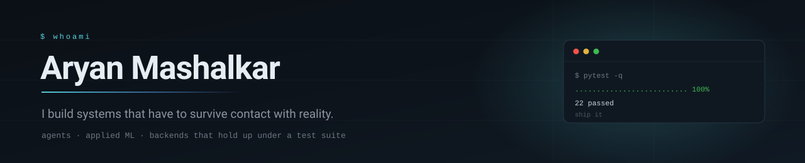

<div align="center">



<br>

[](https://github.com/AryanMashalkar)
[](#selected-work)
[](#selected-work)

</div>

---

### About

I like problems where the hard part isn't the model — it's everything around it.
Concurrency, state that survives a restart, and the edge case that only shows up
once you point the thing at a real user.

Most of what I build ends up with a test suite, because that's usually where I
find out I was wrong.

```python
stack = {
    "languages":  ["Python", "TypeScript", "C#", "JavaScript"],
    "working_on": "agents that talk to real people on real channels",
    "learning":   "distributed systems, evaluation harnesses",
    "principle":  "if the demo is mocked, it isn't done",
}
```

---

### Selected work

<table>
<tr>
<td width="50%" valign="top">

#### [Quorum](https://github.com/AryanMashalkar/quorum-consensus-broker)
`Python` · `caspian-sdk` · `Gemini`

An agent that settles group decisions **without a group chat**. It runs a
separate private negotiation with each person on the channel they already use —
email, Telegram — behind one handler.

When no option is unanimous it doesn't report a tie: it goes back to *only* the
person blocking, or promotes someone's counter-proposal and re-opens it.

</td>
<td width="50%" valign="top">

#### [SKIN_AI](https://github.com/AryanMashalkar/SKIN_AI)
`TypeScript` · `MediaPipe` · `CIELAB`

Skin analysis and personal-colour web app — 11 dermatological scores from one
selfie.

sRGB → CIELAB colour engine with a 12-season classifier and a
FaceLandmarker pipeline. CI is gated on model accuracy, so a regression can't
merge.

</td>
</tr>
<tr>
<td width="50%" valign="top">

#### [Wellbore Geology Prediction](https://github.com/AryanMashalkar/wellbore-geology-prediction)
`Python` · `optimisation`

Automated geosteering for the ROGII Kaggle competition. Sparse weighted
least-squares structural inversion plus gamma-ray path refinement.

Pooled RMSE **15.88 → 12.47 (−21.5%)** across 773 wells.

</td>
<td width="50%" valign="top">

#### [PTCG Battle Agent](https://github.com/AryanMashalkar/ptcg-battle-agent)
`Python` · `search` · `MCTS`

A Pokémon TCG rules engine and agent ladder over a 1,267-card pool.

Beam search over turn plans with root determinization and UCB1, an Elo
evaluation harness, and 114 pytest tests holding the rules engine honest.

</td>
</tr>
<tr>
<td width="50%" valign="top">

#### [Gym Coach API](https://github.com/AryanMashalkar/gym-coach-api)
`C#` · `ASP.NET Core 8` · `EF Core`

Layered Web API with JWT refresh-token rotation and RFC 7807 error middleware.

44 xUnit tests running in CI against a live SQL Server container — not a mock.

</td>
<td width="50%" valign="top">

#### [Daily Puzzle Logic Game](https://github.com/AryanMashalkar/daily-puzzle-logic-game)
`JavaScript`

A daily logic puzzle with streak tracking and a heatmap of your history.

Small, but the kind of thing people actually come back to.

</td>
</tr>
</table>

---

### Toolbox

<div align="center">


<br>


<br>


<br>


</div>

---

### Activity

<div align="center">


<br><br>


</div>

---

<div align="center">
<sub>Currently building agents that can reach anyone.</sub>
</div>
